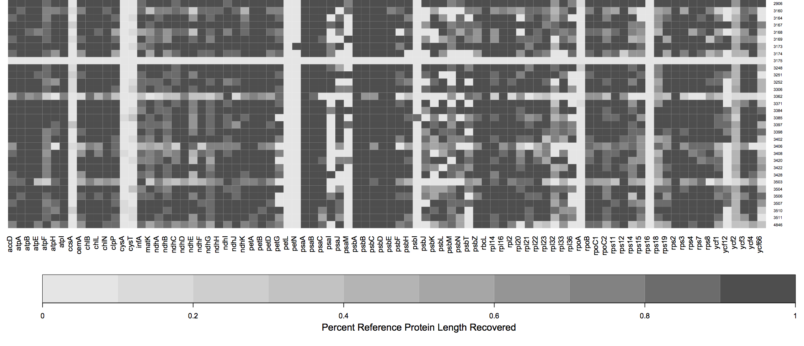

#HybSeq Pipeline
Please cite the following DOI while the manuscript is in preparation:


http://dx.doi.org/10.5281/zenodo.11977

*Manuscript in Preparation*

by Matt Johnson and Norm Wickett, Chicago Botanic Garden

*Purpose* 

Targeted bait capture is a technique for sequencing many loci simultaneously based on bait sequences.
This pipeline starts with Illumina reads, and assigns them to target genes using BLASTx or BWA.
The reads are distributed to separate directories, where they are assembled separately using Velvet and CAP3. 
The main output is a FASTA file of the (in frame) CDS portion of the sample for each target region, and a separate file with the translated protein sequence.

---
#Dependencies
* Python 2.7 or later (to use the argparse module for help documents)
* [BIOPYTHON 1.59 or later](http://biopython.org/wiki/Main_Page) (For parsing and handling FASTA and FASTQ files)
* [EXONERATE](http://www.ebi.ac.uk/~guy/exonerate/) (For aligning recovered sequences to target proteins)
* [BLAST command line tools](ftp://ftp.ncbi.nlm.nih.gov/blast/executables/blast+/LATEST/) (Aligning reads to target protiens)
* [Velvet](https://www.ebi.ac.uk/~zerbino/velvet/) (Assembling reads that map to each target separately)
* [CAP3](http://seq.cs.iastate.edu/cap3.html) (Combining results of multiple Velvet assemblies)
* [GNU Parallel](http://www.gnu.org/software/parallel/) (Handles parallelization of BLAST, Velvet, CAP3, and Exonerate)

*Required for BWA version of the pipeline*:

* [BWA](http://bio-bwa.sourceforge.net/) (Aligns reads to target nucleotide sequences)
* [samtools](http://www.htslib.org/) (Read/Write BAM files to save space).

---
#Setup
##Install the dependencies.
Normal installations are fine for most tools (see below for installation of Velvet), as long as they are in your `$PATH`.
You can check the installation by executing the `readsfirst.py` script with the `--check-depend` flag.

NOTE: Velvet must be compiled with the ability to handle k-mer values > 31:

	make 'MAXKMERLENGTH=67' 

###MACOSX installation notes

Both Exonerate and Velvet require zlib. 
Perhaps the easiest way to install Exonerate is with homebrew: http://brew.sh/
Install homebrew, and then "tap" the science repository:
	brew tap homebrew/science
Now install exonerate:
	brew install exonerate

For velvet, this command line worked for me in Mac OS 10.9:

`make 'MAXKMERLENGTH=67' LDFLAGS='-L third-party/zlib-1.2.3/ -lm’`

##Preparing your files
**IMPORTANT**: If you are using BLAST to map reads to targets, you need a PROTEIN baitfile.

If you are using BWA, you need a NUCLEOTIDE baitfile. 

Construct a "bait file" of protein sequences. If you have just one sequence per bait, simply concatenate all of them into one file.
If you have more than one sequence per bait, they need to be identified before concatenation.
The ID for each sequence should include the bait source and the protein ID, separated by a hyphen. For example:

`>Amborella-atpH
MNPLISAASVIAAGLAVGLASIGPGVGQGTAAGQAVEGIARQPEAEGKIRGTLLLSLAFM`

To execute the entire pipeline, create a directory containing the paired-end read files.
The script `reads_first.py` will create a directory based on the fastq filenames (or use the `--prefix` flag):

`Anomodon-rostratus_L0001_R1.fastq` ---> `Anomodon-rostratus/`

##Running the pipeline

The following command will execute the entire pipeline on a pair of Illumina read files, using the baits in the file `baits.fasta`. The HybSeqPipeline scripts should be in a different directory:

```python /Users/mehmattski/HybSeqPipeline/reads_first.py -r MySpecies_R1.fastq MySpecies_R2.fastq -b baits.fasta```

For best results, these three input files should be in the current directory.

The BLASTx version of the pipeline (default) is intended for amino acid sequences.
Although it is slower than the BWA version, it may have higher specificity.
Reads may not align to divergent nucleotide bait sequences, which are required for the BWA version.
If you find the recovery efficiency is poor with BWA, you may want to try again with BLASTx.


#Pipeline Scripts

##`reads_first.py`
A wrapper script that:

1. Can check if all dependencies are installed correctly. (`--check-depend`)

2. Creates sub-directories.

3. Calls all downstream analyses

You can tell the script to skip upstream steps (for example: `--no-blast`) but the script will still assume that the output files of these steps still exist!

This script will call, in order:

1. Blastx (or BWA)

2. `distribute_reads_to_targets.py` (or `distribute_reads_to_targets_bwa.py`)  and `distribute_targets.py`

3. `velveth` and `velvetg`

4. `CAP3`

5. `exonerate_hits.py`

Some program-specific options may be passed at the command line. 

For example, the e-value threshold for BLASTX (`--evalue`, default is `1e-9`), the coverage-cutoff level for Velvet assemblies (`--cov_cutoff`, default is `5`), or the percent-identity threshold for aligning contigs to the reference sequences (`--thresh`, the default is `55`).

Use `reads_first.py -h` for a full list.	

##`distribute_reads_to_targets.py`
After a BLASTx search of the raw reads against the target sequences, the reads need to be 
sorted according to the successful hits. This script takes the BLASTx output (tabular)
and the raw read files, and distributes the reads into FASTA files ready for assembly.

If there are multiple BLAST results (for example, one for each read direction),
concatenate them prior to sorting.

##`distribute_reads_to_targets_bwa.py`
After a BWA search of the raw reads against the target sequences, the reads need to be 
sorted according to the successful hits. This script takes the bam output (parsed using samtools)
and the raw read files, and distributes the reads into FASTA files ready for assembly.

If there are multiple BAM results (for example, one for each read direction),
concatenate them prior to sorting.

##`distribute_targets.py`
Given a file containing all of the "baits" for a target enrichment, create separate
FASTA files with all copies of that bait. Multiple copies of the same bait can be 
specified using a "-" delimiter. For example, the following will be sorted in to the same
file:

`Anomodon-rbcl`

`Physcomitrella-rbcl`

Given multiple baits, the script will choose the most appropriate 'reference' sequence
using the highest cumulative BLAST scores across all hits. If the search was BWA rather than BLAST, it will use the BWA alignment score.

Output directories can also be created, one for each target category (the default is to put them all in the current one). The field delimiter may also be changed.


##`exonerate_hits.py`
This script generates alignments of velvet/CAP3 contigs against the target sequence. 

If BLASTx is used, the model is `protein2genome`

If BWA is used, the model is `coding2genome`

Contigs are not expected to overlap much. An inital exonerate search is filtered for hits that are above a certain threshold (default is 55, can be changed in ``reads_first.py`` with `--thresh`). Contigs that pass this filter are arranged in order along the alignment. If one contig completely subsumes the range of another contig, the longer contig is saved. 

To maximize the chance that Exonerate may find introns, all contigs that pass the previous steps are concatenated into a "supercontig" and the exonerate search is repeated. Once again, unique hits that pass a percent identity threshold and do not overlap with longer hits are saved, and from this the full length CDS and protein sequences are generated.

In the older version of the script ("assemble-first"), the script was used after the `query_file_builder` is complete. The minimal inputs are the tailored bait file and the assembly.

If run immediately after query_file_builder, use the --prefix flag to specify the file names:

EXAMPLE COMMAND LINE:

```exonerate_hits.py speciesName/baitfile.FAA speciesName/assembly.fasta --prefix=speciesName```

The threshold for accepting an exonerate hit can be adjusted with `-t` (Default: 55 percent)

-----

#RESULTS AND OUTPUT FILES

##Base directory
(Specified by ``--prefix`` or generated from the read file names)
 
1. The master bait file is copied here

2. A BLAST or BWA database is generated

3. One directory is generated for every gene with BLAST or BWA hits. 

4. A file "bait_tallies.txt" summarizes which bait sources were chosen.
	
##Gene Directory
1.	Velvet and CAP3 results. Final assembly is at "GeneName_cap3ed.fa"

2.	Fasta file for reference bait chosen by the `distribute_targets.py` script.

3.	Directory of Exonerate results (with same name as the sample)

##Exonerate Directory

1.	`exonerate_results.fasta` -- Results of the initial exonerate search for all contigs.

2.	`supercontig_exonerate.fasta` -- Long concatenated contig from final exonerate search.

3.	sequences directory

##Sequences directory

1.	`FNA/GeneName.FNA`: In-frame nucleotide sequence

2.	`FAA/GeneName.FAA`: Amino acid sequence.
	
#Summary

The major steps of the pipeline include:

1. Blast (or BWA) search of the reads against the target sequences.

2. Distribution of reads into separate directories, one per gene.

3. Assembly of reads for each gene into contigs with Velvet, using multiple k-mer values. The multiple runs of Velvet are summarized using CAP3.

4. Conduct one or more exonerate searches for each contig in the assembly. If multiple contigs match the same protein in non-overlapping sequences, stitch the hits together into a “supercontig”

5. In a subdirectory, generate separate FASTA files containing either the nucleotide (FNA) or amino acid (FAA) sequence for each protein. 

-----

#After the pipeline
Optional utilities after running the pipeline for multiple assemblies: 

**NOTE**: for these utilities to work, the files must be in the same directory hierarchy created by the pipeline. (i.e. `species/sequences/FAA/` and `species/sequences/FNA/`)

##`get_seq_lengths.py`

This script will summarize the recovery of genes from multiple samples. If you have all of these separate runs of the HybSeqPipeline in the same directory, create a `namelist.txt` file that contains a list of all the HybSeqPipeline directories for each sample (one per line):

```
Sample1
Sample2
Sample3
```

Specify the location of the bait file and whether it is amino acid or nucleotide on the command line:

###Example Command Line

`python get_seq_lengths.py baitfile.fasta namelist.txt dna > gene_lengths.txt`

The script will output a table to `stdout`. The first line is a header containing the gene names. The second line contains the length of the reference for each gene. If there are multiple reference sequences for each gene, an average is reported. The remaining lines are the lengths recovered by the HybSeqPipeline for each sample, one sample per line (one column per gene). If the gene is missing, a 0 is indicated.

###Example output
```
Species	26S	18S
MeanLength	3252.0	1821.6
funaria	3660	1758
timmia	3057	1821
```

##`gene_recovery_heatmap.R`

This script takes the ouput of `get_seq_lengths.py` and creates a figure to visualize the recovery efficiency.

Unlike the python scripts, you will need to open the R script in a text editor or RStudio and edit a few parameters before running the script within R. 

The script requires two R packages: `gplots` and `heatmap.plus` 
Install these using `install.packages` before running the script.
You will need to set the name of your input file (the one produced by `get_seq_lengths.py`) at the top of the script.
The output will look something like this:



Each row shows a sample, and each column is a gene (in this case, one of the 44 chloroplast genes). The amount of shading in each box corresponds to the length of the gene recovered for that sample, relative to the length of the reference (bait). 

In this case, there are a few samples for which few or no genes were recovered (white rows) and a few genes that were not recovered in any sample (white columns). 


##`retrieve_sequences.py`

This script fetches the sequences recovered from the same gene for many samples and generates an unaligned multi-FASTA file for each gene. 

This script will get the sequences generated from multiple runs of the HybSeqPipeline (reads_first.py).
Have all of the runs in the same directory (sequence_dir). 
It retreives all the gene names from the bait file used in the run of the pipeline.

###Example Command Line

`python retrieve_sequences.py baitfile.fasta sequence_dir dna`

You must specify whether you want the protein (aa) or nucleotide (dna) sequences.

Will output unaligned fasta files, one per gene, to the current directory.


-----

#DEPRECATED SCRIPTS
These scripts are left over from a version of the pipeline that started with sequence assemblies, rather than raw reads.

##`query_file_builder.py`

This script generates the "tailored baitfile" for the species by choosing the best representative at each gene using a BLAST search against the assembly file. It also sets up all of the necessary file hierarchy to run the next step of the pipeline.

The input to the script requires a fasta file containing protein bait sequences, as described in Setup, and the nucleotide assembly file.

The script will use the prefix of the assembly file to generate a directory containing all the results. For the cleanest results, create a new directory, and use relative or absolute paths to indicate the locations of both the protein and assembly file.

For example, if one level up there is one directory containing baits and another containing assemblies:

EXAMPLE COMMAND LINE

`query_file_builder.py ../baits/all_plastid_baits.FAA ../assemblies/speciesName.fasta`


